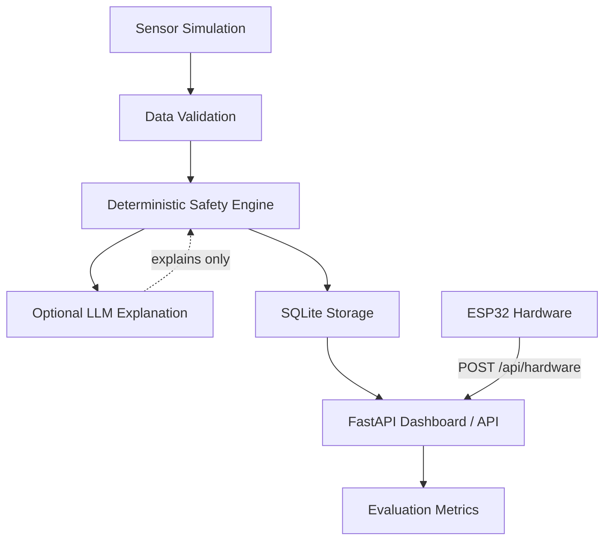

# IoT-TrustBench

A software-based framework to evaluate safe IoT classification using simulated sensor data. The deterministic safety engine is the sole decision-maker; any LLM integration is strictly limited to post-hoc explanation.

> **Disclaimer:** This is a simulation and research project. It is **not** a real-world safety-control system and must not be used to control physical devices or make autonomous safety decisions.

## Architecture



## Features

- **Virtual IoT Simulation** - Generate realistic sensor data without hardware
- **6 Decision Classes** - Normal, Emergency, Sensor Fault, Spoofing, Offline, Uncertain
- **Deterministic Safety Engine** - Rule-based classifier is the only decision-maker
- **Trusted Device Registration** - Secure device trust workflow with SQLite backend
- **Hardware Integration** - Connect real ESP32 sensor nodes (optional)
- **Web Dashboard** - Professional UI with charts, confusion matrix, and metrics
- **Batch Testing** - Run 100+ scenarios across all 6 classes
- **Comprehensive Evaluation** - Per-class precision/recall/F1, confusion matrix, dangerous error rate
- **API Documentation** - Auto-generated Swagger docs at `/docs`
- **No API Key Required** - Works fully in local mode

## Quick Start

```bash
# Install dependencies
pip install -r requirements.txt

# (Optional) Configure LLM
cp .env.example .env
# Edit .env if you want Gemini/OpenAI explanations

# Start server
python run.py

# Open browser
http://localhost:8000
```

## Decision Classes

| Class | Description | Action |
|-------|-------------|--------|
| **Normal** | All readings within normal ranges from a registered device | None |
| **Emergency** | Multiple sensors confirm dangerous conditions (score >= 3) | Alert |
| **Sensor Fault** | One sensor abnormal, others disagree - physically inconsistent readings | Verify |
| **Spoofing** | Invalid data, impossible values, or unknown/unregistered device | Block |
| **Offline** | Data missing, stale (>10 min), or device power is off | Wait |
| **Uncertain** | Conflicting evidence, borderline readings, or validation warnings | Human verify |

### Emergency vs Sensor Fault

A real emergency requires supporting evidence from **more than one sensor**. A very high temperature alone with normal smoke and gas is treated as a sensor fault, not an emergency. Conflicting evidence produces "uncertain" and requires human verification.

## Hardware Integration (Optional)

### Required Parts
- ESP32 DevKit V1 (~$5-8)
- DHT22 Temperature/Humidity Sensor (~$3-5)
- MQ-2 Gas/Smoke Sensor (~$2-4)
- HC-SR501 PIR Motion Sensor (~$1-2)
- Magnetic Reed Switch (~$1)
- Jumper wires + breadboard (~$5)

**Total: ~$17-27**

### Wiring
```
DHT22 DATA → ESP32 GPIO4
MQ-2 AOUT  → ESP32 GPIO34
PIR OUT    → ESP32 GPIO27
Reed Switch → ESP32 GPIO26
```

### Setup
1. Open `hardware/esp32_sensor_node/esp32_sensor_node.ino` in Arduino IDE
2. Edit WiFi SSID, password, and server IP
3. Upload to ESP32
4. Open Serial Monitor at 115200 baud
5. View live data at `http://localhost:8000/hardware`

Full wiring guide: `hardware/WIRING_GUIDE.md`

### Trusted Device Registration

Unknown hardware devices are **not** automatically trusted. They will be classified as spoofing. To register a device:

```bash
# Register a device
curl -X POST http://localhost:8000/api/trusted-devices \
  -H "Content-Type: application/json" \
  -d '{"device_id": "DEV-001-TEMP", "device_name": "Living Room Sensor"}'

# List trusted devices
curl http://localhost:8000/api/trusted-devices

# Disable a device
curl -X PUT http://localhost:8000/api/trusted-devices/DEV-001-TEMP/enable \
  -H "Content-Type: application/json" -d '{"enabled": false}'

# Re-enable a device
curl -X PUT http://localhost:8000/api/trusted-devices/DEV-001-TEMP/enable \
  -H "Content-Type: application/json" -d '{"enabled": true}'

# Remove a device
curl -X DELETE http://localhost:8000/api/trusted-devices/DEV-001-TEMP
```

## Project Structure

```
iot_trustbench/
├── core/
│   ├── sensor_simulator.py   # Virtual sensor data generation
│   ├── data_validator.py     # Range, timestamp, device, consistency validation
│   ├── safety_engine.py      # Deterministic classification rules
│   └── llm_explainer.py      # LLM explanation generation (optional)
├── api/
│   └── app.py                # FastAPI application & routes
├── database/
│   └── db.py                 # SQLite operations & metrics
├── static/css/style.css      # Modern CSS design system
├── templates/                # Jinja2 HTML templates
│   ├── base.html             # Base layout with sidebar
│   ├── home.html             # Dashboard overview
│   ├── live.html             # Live simulation
│   ├── scenarios.html        # Batch test runner
│   ├── history.html          # Decision history
│   ├── evaluation.html       # Metrics + charts
│   └── hardware.html         # Hardware integration
├── scenarios/
│   └── test_scenarios.json   # 100 labelled scenarios
└── tests/
    ├── test_core.py          # Core unit tests (10 tests)
    ├── test_edge_cases.py    # Edge-case boundary tests (30 tests)
    ├── test_batch.py         # Batch evaluation (all 6 classes)
    └── test_api_smoke.py     # API endpoint smoke tests (10 tests)
```

## API Endpoints

| Method | Endpoint | Description |
|--------|----------|-------------|
| POST | `/api/simulate` | Run simulated test |
| POST | `/api/hardware` | Receive hardware data |
| GET | `/api/hardware/readings` | Hardware reading history |
| GET | `/api/hardware/devices` | Connected devices |
| GET | `/api/hardware/latest` | Latest hardware reading |
| GET | `/api/scenarios` | List scenarios |
| GET | `/api/decisions` | Decision history |
| POST | `/api/batch-test` | Run batch evaluation (all 6 classes) |
| GET | `/api/evaluation` | Accuracy metrics |
| POST | `/api/reset-history` | Clear all data |
| POST | `/api/trusted-devices` | Register a trusted device |
| GET | `/api/trusted-devices` | List trusted devices |
| GET | `/api/trusted-devices/{id}` | Get a trusted device |
| PUT | `/api/trusted-devices/{id}/enable` | Enable/disable device |
| DELETE | `/api/trusted-devices/{id}` | Remove trusted device |

## Testing

```bash
# Unit tests (10 tests)
python -m pytest iot_trustbench/tests/test_core.py -v

# Edge-case tests (30 tests)
python -m pytest iot_trustbench/tests/test_edge_cases.py -v

# API smoke tests (10 tests)
python -m pytest iot_trustbench/tests/test_api_smoke.py -v

# All tests (50 tests)
python -m pytest iot_trustbench/tests/ -v

# Batch evaluation (all 6 classes, 120 samples)
python iot_trustbench/tests/test_batch.py
```

## Evaluation Metrics

The evaluation system calculates:

- **Overall accuracy** - Percentage of correct classifications
- **Per-class precision** - Of all predicted X, how many were actually X
- **Per-class recall** - Of all actual X, how many were correctly predicted
- **Per-class F1-score** - Harmonic mean of precision and recall
- **Confusion matrix** - Full 6x6 predicted vs actual breakdown
- **False alarm rate** - Normal/sensor_fault incorrectly classified as emergency
- **Dangerous error rate** - Emergency incorrectly classified as normal
- **Missed emergency rate** - Emergency classified as anything other than emergency
- **Correct uncertain rate** - Uncertain cases correctly identified
- **Spoof detected count** - Spoofing attempts correctly detected

## LLM Configuration (Optional)

The system works fully without an API key. LLM explanations are optional.

```bash
# Local mode (default, no API key needed)
set LLM_BACKEND=local

# Gemini
set LLM_BACKEND=gemini
set LLM_API_KEY=your_api_key

# OpenAI-compatible
set LLM_BACKEND=openai
set LLM_API_KEY=your_api_key
set LLM_BASE_URL=https://api.openai.com
set LLM_MODEL=gpt-4o-mini
```

Supported backends: `local`, `gemini`, `openai`, `none`

The LLM prompt explicitly instructs the model to:
- NOT change the classification
- NOT invent facts
- NOT give physical-device control instructions
- State that human verification is required when the decision says so

## Technology Stack

- **Backend:** Python 3 + FastAPI
- **Frontend:** HTML + CSS + Bootstrap Icons + Chart.js
- **Database:** SQLite (aiosqlite)
- **Hardware:** ESP32 + DHT22 + MQ-2 + PIR + Reed Switch (optional)
- **LLM:** Gemini API / OpenAI / Local fallback (optional)
- **Testing:** pytest

## Limitations

- This is a simulation framework, not a real safety-control system
- The deterministic rules are intentionally conservative and may produce false positives
- LLM explanations are optional and never influence the safety classification
- Hardware integration requires manual WiFi configuration on the ESP32
- The trusted device list is per-database instance (not distributed)
- Sensor simulation uses simplified ranges; real sensors have more complex behavior

## Future Work

- Multi-node sensor fusion across multiple ESP32 devices
- Time-series analysis for trend detection
- Configurable rule thresholds via API
- User authentication for trusted device management
- Export/import of test results and metrics
- Integration with MQTT for real-time IoT protocols
- Machine learning classifier comparison (rules vs trained model)

## License

MIT License - see [LICENSE](LICENSE)

Copyright (c) 2026 vegapunk-io
