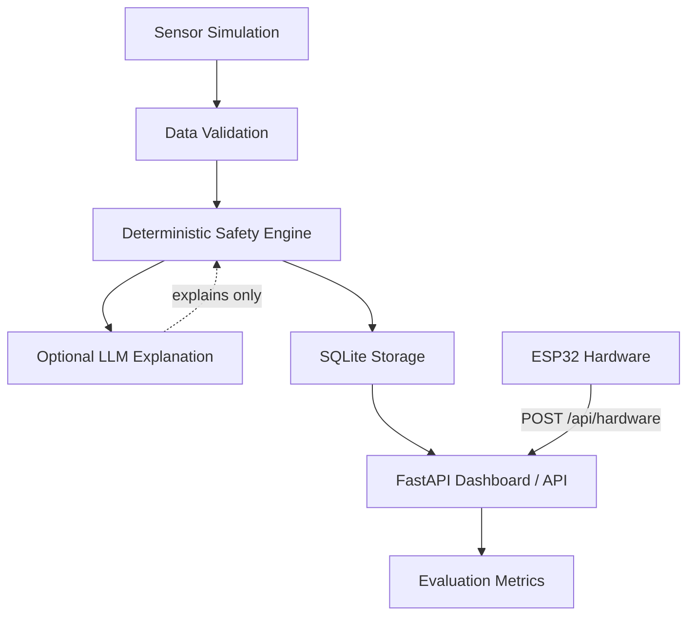

<div align="center">

# 🔐 IoT-TrustBench

### A software-based framework to evaluate safe LLM decisions using simulated IoT sensor data.

**Deterministic rules classify first. The LLM explains — it never decides.**

[](https://iot-trustbench.onrender.com/)
[](https://iot-trustbench.onrender.com/docs)
[](LICENSE)


</div>

---

<p align="center">
  
</p>

> ⚠️ **Disclaimer:** This is a **simulation and research project**. It is **not** a real-world safety-control system and must not be used to control physical devices or make autonomous safety decisions.

---

## 📑 Table of Contents

- [🚀 Live Demo](#-live-demo)
- [✨ Features](#-features)
- [🧠 How It Works](#-how-it-works)
- [🏷️ Decision Classes](#️-decision-classes)
- [⚡ Quick Start (Local)](#-quick-start-local)
- [☁️ Deploy on Render](#️-deploy-on-render)
- [📟 Hardware Integration (Optional)](#-hardware-integration-optional)
- [🔌 API Endpoints](#-api-endpoints)
- [🧪 Testing](#-testing)
- [📊 Evaluation Metrics](#-evaluation-metrics)
- [🤖 LLM Configuration](#-llm-configuration)
- [🔐 Trusted Device Registration](#-trusted-device-registration)
- [📁 Project Structure](#-project-structure)
- [⚠️ Limitations](#️-limitations)
- [🗺️ Roadmap](#️-roadmap)
- [📄 License](#-license)

---

## 🚀 Live Demo

The project is **deployed and publicly accessible on Render** — no installation needed:

<div align="center">

### 🌐 **https://iot-trustbench.onrender.com/**

</div>

- ✅ Runs in **local mode** — no LLM API key required
- ✅ Fresh SQLite database on every deploy
- ✅ Run simulations, batch-test **100+ scenarios**, and explore evaluation metrics
- ✅ Interactive Swagger API docs at [`/docs`](https://iot-trustbench.onrender.com/docs)

---

## ✨ Features

| | |
|---|---|
| 🖥️ **Virtual IoT Simulation** | Generate realistic sensor data without any hardware |
| 🏷️ **6 Decision Classes** | Normal, Emergency, Sensor Fault, Spoofing, Offline, Uncertain |
| 🛡️ **Deterministic Safety Engine** | Rule-based classifier is the *only* decision-maker |
| 🔑 **Trusted Device Registration** | Secure device trust workflow with SQLite backend |
| 📟 **Hardware Integration** | Connect real ESP32 sensor nodes (optional) |
| 📊 **Web Dashboard** | Professional UI with charts, confusion matrix & metrics |
| 🧪 **Batch Testing** | Run 100+ scenarios across all 6 classes |
| 📈 **Comprehensive Evaluation** | Per-class precision/recall/F1, confusion matrix, dangerous error rate |
| 📖 **API Documentation** | Auto-generated Swagger docs at `/docs` |
| 🆓 **No API Key Required** | Works fully in local mode |

---

## 🧠 How It Works



### ⚡ Processing Pipeline

`1. Simulate` → `2. Validate` → `3. Classify` → `4. Explain` → `5. Display` → `6. Evaluate`

### 🛡️ Safety Design

| Principle | Details |
|---|---|
| **Key Principle** | The LLM does **NOT** make safety decisions. Deterministic Python rules classify first. |
| **LLM Role** | Receives classification + evidence, generates plain-language explanation **only**. |
| **Why It Matters** | Prevents the LLM from freely deciding safety-critical outcomes based on text interpretation. |

---

## 🏷️ Decision Classes

| Class | Description | Action |
|-------|-------------|--------|
| 🟢 **Normal** | All readings within normal ranges from a registered device | None |
| 🔴 **Emergency** | Multiple sensors confirm dangerous conditions (score ≥ 3) | Alert |
| 🟠 **Sensor Fault** | One sensor abnormal, others disagree — physically inconsistent readings | Verify |
| ⚫ **Spoofing** | Invalid data, impossible values, or unknown/unregistered device | Block |
| 🔵 **Offline** | Data missing, stale (>10 min), or device power is off | Wait |
| 🟣 **Uncertain** | Conflicting evidence, borderline readings, or validation warnings | Human verify |

> **💡 Emergency vs Sensor Fault:** A real emergency requires supporting evidence from **more than one sensor**. A very high temperature alone with normal smoke and gas is treated as a sensor fault, not an emergency. Conflicting evidence produces "uncertain" and requires human verification.

---

## ⚡ Quick Start (Local)

```bash
# 1. Clone the repository
git clone https://github.com/vegapunk-io/IoT-TrustBench.git
cd IoT-TrustBench

# 2. Install dependencies
pip install -r requirements.txt

# 3. (Optional) Configure LLM
cp .env.example .env
# Edit .env if you want Gemini/OpenAI explanations

# 4. Start server
python run.py

# 5. Open browser
http://localhost:8000
```

---

## ☁️ Deploy on Render

The app is a standard FastAPI web service and deploys to Render in minutes:

1. Push this repository to GitHub
2. In the [Render dashboard](https://dashboard.render.com/), create a **New Web Service** and connect the repo
3. Use these settings (no config file required):

| Setting | Value |
|---------|-------|
| **Build Command** | `pip install -r requirements.txt` |
| **Start Command** | `uvicorn iot_trustbench.api.app:app --host 0.0.0.0 --port $PORT` |
| **Instance Type** | Free (or any paid plan) |

4. Optional environment variables (see `.env.example`): `LLM_BACKEND`, `LLM_API_KEY`, `ADMIN_API_KEY`, `IOT_DB_PATH`

> **📌 Note:** Render's free tier uses an ephemeral filesystem — the SQLite database resets whenever the service restarts. For persistent data, attach a persistent disk at `/var/data` and set `IOT_DB_PATH=/var/data/iot_trustbench.db`.

---

## 📟 Hardware Integration (Optional)

### Required Parts

| Part | Cost |
|------|------|
| ESP32 DevKit V1 | ~$5–8 |
| DHT22 Temperature/Humidity Sensor | ~$3–5 |
| MQ-2 Gas/Smoke Sensor | ~$2–4 |
| HC-SR501 PIR Motion Sensor | ~$1–2 |
| Magnetic Reed Switch | ~$1 |
| Jumper wires + breadboard | ~$5 |

**Total: ~$17–27**

### Wiring

```text
DHT22 DATA    → ESP32 GPIO4
MQ-2 AOUT     → ESP32 GPIO34
PIR OUT       → ESP32 GPIO27
Reed Switch   → ESP32 GPIO26
```

### Setup

1. Open `hardware/esp32_sensor_node/esp32_sensor_node.ino` in Arduino IDE
2. Edit WiFi SSID, password, and server IP
3. Upload to ESP32
4. Open Serial Monitor at 115200 baud
5. View live data at `http://localhost:8000/hardware`

Full wiring guide: [`hardware/WIRING_GUIDE.md`](hardware/WIRING_GUIDE.md)

---

## 🔌 API Endpoints

| Method | Endpoint | Description |
|--------|----------|-------------|
| POST | `/api/simulate` | Run simulated test |
| POST | `/api/hardware` | Receive hardware data |
| GET | `/api/hardware/readings` | Hardware reading history |
| GET | `/api/hardware/devices` | Connected devices |
| GET | `/api/hardware/latest` | Latest hardware reading |
| GET | `/api/scenarios` | List scenarios |
| GET | `/api/decisions` | Decision history |
| POST | `/api/batch-test` | Run batch evaluation (all 6 classes) |
| GET | `/api/evaluation` | Accuracy metrics |
| POST | `/api/reset-history` | Clear all data |
| POST | `/api/trusted-devices` | Register a trusted device |
| GET | `/api/trusted-devices` | List trusted devices |
| GET | `/api/trusted-devices/{id}` | Get a trusted device |
| PUT | `/api/trusted-devices/{id}/enable` | Enable/disable device |
| DELETE | `/api/trusted-devices/{id}` | Remove trusted device |

> Full interactive docs available at `/docs` (Swagger UI).

---

## 🧪 Testing

```bash
# All tests (57 tests, uses temporary test database)
python -m pytest iot_trustbench/tests/ -v

# Unit tests only (10 tests)
python -m pytest iot_trustbench/tests/test_core.py -v

# Edge-case tests (34 tests)
python -m pytest iot_trustbench/tests/test_edge_cases.py -v

# API smoke tests (13 tests)
python -m pytest iot_trustbench/tests/test_api_smoke.py -v

# Batch evaluation (all 6 classes, 120 samples)
python iot_trustbench/tests/test_batch.py
```

---

## 📊 Evaluation Metrics

The evaluation system calculates:

- **Overall accuracy** — percentage of correct classifications
- **Per-class precision / recall / F1** — for each of the 6 classes
- **Confusion matrix** — full 6×6 predicted vs actual breakdown
- **False alarm rate** — normal/sensor_fault incorrectly classified as emergency
- **Dangerous error rate** — emergency incorrectly classified as normal
- **Missed emergency rate** — emergency classified as anything other than emergency
- **Correct uncertain rate** — uncertain cases correctly identified
- **Spoof detected count** — spoofing attempts correctly detected

---

## 🤖 LLM Configuration

The system works **fully without an API key** — LLM explanations are optional.

```bash
# Local mode (default, no API key needed)
set LLM_BACKEND=local

# Gemini
set LLM_BACKEND=gemini
set LLM_API_KEY=your_api_key

# OpenAI-compatible
set LLM_BACKEND=openai
set LLM_API_KEY=your_api_key
set LLM_BASE_URL=https://api.openai.com
set LLM_MODEL=gpt-4o-mini
```

Supported backends: `local`, `gemini`, `openai`, `none`

The LLM prompt explicitly instructs the model to:

- ✅ NOT change the classification
- ✅ NOT invent facts
- ✅ NOT give physical-device control instructions
- ✅ State that human verification is required when the decision says so

---

## 🔐 Trusted Device Registration

Unknown hardware devices are **not** automatically trusted — they will be classified as spoofing. To register a device, you need the `X-Admin-Key` header (if `ADMIN_API_KEY` is set):

```bash
# Register a device (requires admin key if ADMIN_API_KEY is set)
curl -X POST http://localhost:8000/api/trusted-devices \
  -H "Content-Type: application/json" \
  -H "X-Admin-Key: your_admin_key" \
  -d '{"device_id": "DEV-001-TEMP", "device_name": "Living Room Sensor"}'

# List trusted devices (no auth required)
curl http://localhost:8000/api/trusted-devices

# Enable / disable a device (requires admin key)
curl -X PUT http://localhost:8000/api/trusted-devices/DEV-001-TEMP/enable \
  -H "Content-Type: application/json" \
  -H "X-Admin-Key: your_admin_key" \
  -d '{"enabled": false}'

# Remove a device (requires admin key)
curl -X DELETE http://localhost:8000/api/trusted-devices/DEV-001-TEMP \
  -H "X-Admin-Key: your_admin_key"
```

If `ADMIN_API_KEY` is not set, the system runs in development mode and all trusted-device endpoints are accessible without a key.

---

## 📁 Project Structure

```text
iot_trustbench/
├── core/
│   ├── sensor_simulator.py   # Virtual sensor data generation
│   ├── data_validator.py     # Range, timestamp, device, consistency validation
│   ├── safety_engine.py      # Deterministic classification rules
│   └── llm_explainer.py      # LLM explanation generation (optional)
├── api/
│   └── app.py                # FastAPI application & routes
├── database/
│   └── db.py                 # SQLite operations & metrics
├── static/
│   └── css/style.css         # Modern CSS design system
├── templates/                # Jinja2 HTML templates
│   ├── base.html             # Base layout with sidebar
│   ├── home.html             # Dashboard overview
│   ├── live.html             # Live simulation
│   ├── scenarios.html        # Batch test runner
│   ├── history.html          # Decision history
│   ├── evaluation.html       # Metrics + charts
│   └── hardware.html         # Hardware integration
├── scenarios/
│   └── test_scenarios.json   # 100 labelled scenarios
└── tests/
    ├── test_core.py          # Core unit tests (10 tests)
    ├── test_edge_cases.py    # Edge-case boundary tests (34 tests)
    ├── test_batch.py         # Batch evaluation (all 6 classes)
    ├── test_api_smoke.py     # API endpoint smoke tests (13 tests)
    └── conftest.py           # Shared pytest fixtures
```

---

## ⚠️ Limitations

- This is a **simulation framework**, not a real safety-control system
- The deterministic rules are intentionally conservative and may produce false positives
- LLM explanations are optional and never influence the safety classification
- Hardware integration requires manual WiFi configuration on the ESP32
- The trusted device list is per-database instance (not distributed)
- Sensor simulation uses simplified ranges; real sensors have more complex behavior

---

## 🗺️ Roadmap

- [ ] Multi-node sensor fusion across multiple ESP32 devices
- [ ] Time-series analysis for trend detection
- [ ] Configurable rule thresholds via API
- [ ] User authentication for trusted device management
- [ ] Export/import of test results and metrics
- [ ] Integration with MQTT for real-time IoT protocols
- [ ] Machine learning classifier comparison (rules vs trained model)

---

## 📄 License

[MIT](LICENSE) © 2026 [vegapunk-io](https://github.com/vegapunk-io)

---

<div align="center">

**Made with 🛡️ for safer IoT + LLM systems**

[Back to top](#-iot-trustbench)

</div>
